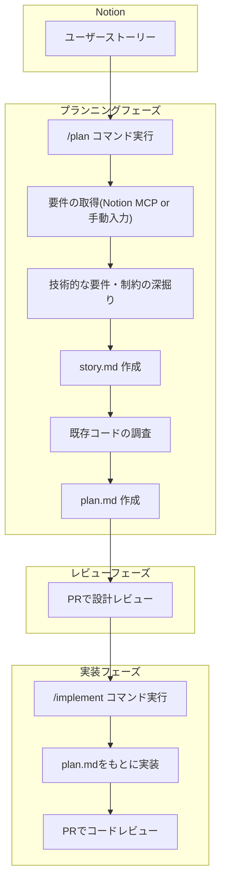

:::message
この記事は、[SmartCamp Advent Calendar 2025](https://qiita.com/advent-calendar/2025/smartcamp) 15日目の投稿です。
:::

この記事では、弊チームの開発フローの課題を解決するために考えた、SDDアプローチを小さく取り入れたplan.md生成・管理方法について紹介します。

## SDD（仕様駆動開発）について

2025年は生成AIによるコーディングエージェント元年とも言える年になりました。多様なツールやサービスが登場し、実際の開発現場での活用が進むにつれて、新たな課題が浮上してきています。
その中でも、仕様や設計が曖昧なままAIにコーディングを任せることによって意図しない動作やバグを引き起こしたり、後の工程で手戻りが発生してしまうようなケースも発生してきています。

この問題に対処するために、SDD（仕様駆動開発）というアプローチに注目が集まりました。SDDは、仕様や設計を事前に明確にし、それに基づいて実装を進めるアプローチです。
AWSのKiroやGitHubのSpec KitなどのSDDアプローチを実現するツールでは、生成AIとの対話を通じて仕様書や設計書などを複数作成し、それらをもとにより正確で高品質なコードを生成することができます。

https://zenn.dev/assign/articles/ab66b2843d9380

https://kiro.dev/

https://github.com/github/spec-kit

一方で、重厚な仕様書や設計書と厳格なフローはすべての開発現場に適しているわけではありません。私も個人のプロジェクトでSpec Kitを利用してみましたが、小さなアプリの開発にしては重厚で過剰なものに感じました。
そのため、世の中にあるツールをそのまま利用するのではなく、チームごとの開発フローに適した形でSDDツールのエッセンスを取り入れたいと考えました。

## 弊チームでの開発フローについて

私たちのチームでは、日常的な機能開発において大雑把に以下のようなフローで開発を行っています。

1. PMが要件を整理し、Notionにユーザーストーリーを記載する
2. 開発チーム内でユーザーストーリーの内容を確認し、要件の不足や不明確な点を洗い出しながら、ストーリーポイントを設定する（リファインメント）
3. 開発チーム全員または特定のエンジニアが1つのユーザーストーリーを担当し、実装タスクへの分解と簡易な設計を行う（プランニング）
4. プランニング内容を開発チーム内でレビューする
5. 実装の準備が整ったら、エンジニアがタスクを取って実装を行い、PRを作成する
6. コードレビューやPM・デザイナーによるレビューを経て、PRのマージ・リリースを行う

:::message
リファインメントやプランニングなどスクラム開発の文脈で登場する用語がありますが、スクラム開発におけるリファインメントやスプリントプランニングと同一視するのではなく、あくまで私たちのチーム内での開発フローの特定の工程をそのように呼称していると捉えていただくのが良いかと思います。
:::

AIコーディングエージェントが台頭してくる中で、課題を感じていたのは3番目のプランニングの工程です。この工程では、ユーザーストーリーに記載された以上の技術的な要件や制限、既存のコードや設計を踏まえた上で適切な設計を行う必要があります。また、タスク管理はNotionで行い、プランニング内容をNotionに記載して開発チーム内でのレビューを行っていました。

課題は以下のようなものです。

* CursorやClaude Codeなどで調査した内容をNotionに転記するのが手間
* Notion上でのプランニングのステータス管理が困難
* プランニング内容をAIコーディングエージェントに渡すのが困難

これらの課題に対して、SDDアプローチを小さく取り入れて改善を図ることにしました。

## plan.mdを自分たちの開発フローに落とし込む

:::message
この記事では、AIコーディングエージェントとしてClaude Codeを使うことを前提とします。
:::

### 方針の決定

まず、SDDツールをそのまま使うことはしませんでした。私たちはNotionでユーザーストーリーおよび実装タスクを管理していたり、独自の開発フローを持っていたりすることから、SDDツールの使い方に合わせるのではなく我々の開発フローに合わせて馴染みやすいフローを考えることにしました。

最初の方針として、実装タスクの設計内容をplan.mdというファイルに記載してgitリポジトリにコミットし、PR上で設計内容のレビューを行うことを出発点としました。PRによるレビューのステータス管理とコメント等のしやすさは快適だったため、プランニングでも同様のフローを採用することを前提としました。

次に、plan.mdの作成を容易にするためのカスタムスラッシュコマンドを作成しました。実装タスクの設計を行う際、基本的には要件の技術的な深掘りや既存コードの調査が必要でした。これらの一般的な調査フローをカスタムスラッシュコマンドにまとめ、設計内容を記載したplan.mdを作成することができるようにしました。また、実装内容を検討するにあたり、Notionに記載されたユーザーストーリーの要件を参照することも必要でした。Notion MCPを使ってNotion上のページの内容を取得する方法や、Notion MCPが使えない人向けには手動で要件を入力する手順をカスタムスラッシュコマンドにまとめました。

### プランニングシステムの構成

ここまでの内容を整理し、作成したプランニングシステムは以下のような構成になりました。

* プランニングシステムのファイル群
  * `plans/stories/{story-id}/story.md`
    * ストーリー全体の概要を記載するファイル
    * 技術的な要件・制約を深掘りした内容も含め、実装タスクの設計検討に必要な内容を記載する
  * `plans/stories/{story-id}/{task-id}/plan.md`
    * タスクの実装計画を記載するファイル
    * Notionに作成したタスクごとに作成し、実装タスクの詳細な設計内容を記載する
* `/plan` コマンド
  * プランニングの起点となるユーザーストーリーの情報を取得し、要件の深掘りをしてstory.mdを作成する
  * story.mdをもとに、実装タスクの設計検討に必要な既存コードの調査を行い、plan.mdを作成する
* `/implement` コマンド
  * タスクIDを指定してplan.mdをもとに実装を行う

:::message
カスタムスラッシュコマンドの詳細についてはここでは割愛しますが、それぞれのコマンドでは
* 各ファイルを生成するまでの実行フロー
* Notion MCPが利用可能であれば、コマンドの引数を解析してNotionのページ内容を取得すること
* Notion MCPが利用できない場合は手動で要件の入力をユーザーに促すこと
* ユーザーからの情報や判断が必要な場合は、Claude CodeのAskUserQuestionツールを活用してユーザーに情報を求めること

などを記載しています。
:::

```
root
├──── .claude/commands/
│   ├── implement.md              # plan.mdをもとに実装を行うコマンド
│   └── plan.md                   # plan.mdの作成コマンドファイル
└──── plans/                      # プランニングシステムのファイル群
    ├── README.md                 # プランニングシステムの説明ファイル
    ├── templates/                # ストーリーテンプレートおよびタスクテンプレート
    │   ├── story-template.md
    │   └── task-template.md
    └── stories/                  # ユーザーストーリーのファイル群
        └── {story-id}/           # ユーザーストーリーID（例: STORY-110）
            ├── story.md          # ストーリー全体の概要ファイル
            └── {task-id}/        # タスクID（例: TASK-1000）
                └── plan.md       # タスクの実装計画ファイル
```

図示すると以下のようなフローになります。


### チームへの展開

ここまでの成果を実際にチームに展開してみたところ、非常に好評でスムーズに使ってもらえました。当初の目論見どおり、Notionとの連携によってスムーズなプランニングが可能になり、またプランニングレビューの管理はPRによって容易に行うことができました。
比較的簡単な実装タスクにおいては、`/implement` コマンドを実行するのみでほぼ完璧なコードを生成できたとの感想もありました。

## カスタムスラッシュコマンドを改善する

作成したシステムをしばらく利用してもらっていたところ、いくつかの改善点が見えてきました。

以下にいくつかの改善内容を簡単に挙げますが、これらはコンテキストウィンドウの制限を考慮したり、Human in the Loopによる品質向上を図ったりする、AIエージェントを活用する上での基本的なアプローチです。

### コンテキストウィンドウの制限への対応

`/plan` コマンドの実行中にClaude Codeのコンテキストウィンドウが制限いっぱいになってしまう課題がありました。
これに対して、既存の `/plan` コマンドを2つに分割しました。story.mdを生成する `/specify` コマンドと、plan.mdを生成する `/plan` コマンドに分けることで、1回のコマンド実行で扱う情報量を削減しました。

### レビュー負荷の軽減

具体的すぎるplan.mdファイルを生成してしまい、レビュー負荷が高いという課題がありました。
これに対しては、生成されるファイルがより簡潔になるようにテンプレートを調整しました。また、AskUserQuestionツールの使用箇所を増やし、人間の判断を適切なタイミングで介入させることで、生成内容の精度を向上させました。

## まとめ

SDDアプローチおよびSDDツールは生成AI時代の開発の1つの手法ですが、チームごとの開発フローに合わせて適切に取り入れていくことでその恩恵を最大限に受けることができます。
今後も自分たちの開発フローを見つめ直しながら、AIを活用したより良い開発フローを追求していきたいと思います。
